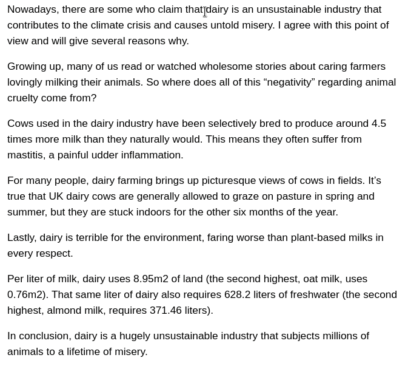

# Structured Argument Mining Crowdsourcing
This is the code repository for structured argument mining experiment.

## The Service
### The Backend
It's a web application based on [psiturk](https://github.com/NYUCCL/psiTurk) framework, which integrates with Amazon Mechanical Turk ([MTurk](https://www.mturk.com/)) platform. See [psiturk](https://github.com/NYUCCL/psiTurk) for how to work with this kind of project.
One difference is that HITs should be created via [create_hit_wrapper.py](scripts/create_hit_wrapper.py) as it additionally adds a feature for associating a HIT with a specific article content (it requires additional [hit_configs](scripts/hit_configs.sql) table). The following figure illustrates the interactions between this service (SAM-crowd) and other systems.

### The Frontend
A slightly modified version of [recogito-js](https://github.com/recogito/recogito-js) is used in the UI to capture the task of structured argument mining. Four types of components are supported: MajorClaim, ClaimFor, ClaimAgainst and Premise, according to the framework proposed by [Stab and Gurevych](https://aclanthology.org/J17-3005/).The annotation interface demo is shown below:

## The Corpus: Persuasive Online Articles on Sustainable Diets (POASD)
The corpus consists of 20 opinion articles from 3 publishers:
- (5) [Plant Based News (PBN)](https://plantbasednews.org/)
- (5) [The Guardian](https://www.theguardian.com/)
- (10) [Altinget](https://www.altinget.dk/) (original and translated to English)

The umbrella topic is sustainable diets, which cover anything related to moving towards more sustainable or plant-based food options. The most common sub-topics in the dataset are the following:
- Innovation in food industry
- Meat alternative
- Cooking education
- Social and cultural challenges of encouraging plant-based diet

The list of article titles and links can be found [here](articles.md). The article extracted contents can be found under [articles](articles), while the annotations of 3 crowdsource workers under [annotations](annotations).

## Other
Repository also contains some useful [scripts](scripts) for: parsing HITs from DB dumps, converting [brat](https://brat.nlplab.org/standoff.html) format to [mrp](https://github.com/cfmrp/mtool), prediction scoring and others.
